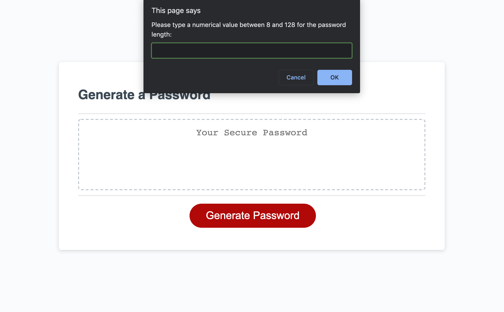

# Password_Generator

## Description

The password generator is an application that produces a random password based on selected criteria. This application runs in the browser and also includes a responsive user interface. The password must be a length of at least 8 characters and no more than 128. After choosing the length of the password, the user is prompted to select which of the following character types to include in the password:

* lowercase

* uppercase

* numeric 

* special characters

After clicking the "generate password" button, the user will select the criteria and be presented with a unique passcode. To access the live URL, please click here [Password_Generator](https://alexhstrickland.github.io/Password_Generator/).

## Usage

When accessing the website, you should start by clicking the "generate password" button. You will then be prompted to answer a series of questions regarding password criteria. You will have to choose a password length between 8 and 128 and at least one character type must be selected for a password to generate. After all questions are answered, your unique passcode will be generated and shown in the user interface. If you would like to view a screenshot of the website, check out .